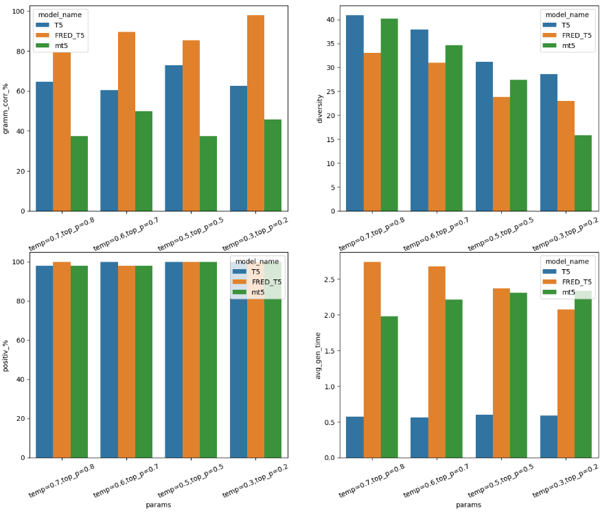

# ИИ вместо астролога или как я создавала астробота Катю


Обучение на курсах NLP от OTUS подходило к концу и нужно было определиться с темой выпускной работы. Я новичок в NLP, но очень хотелось присоединиться к всеобщему хайпу по поводу GPT и своими руками пощупать генеративные модели. Мне, как любителю гороскопов, показалась интересной идея обучить языковую модель писать ежедневные прогнозы по знаку Зодиака и обернуть ее чат-бот, который бы генерировал предсказание по запросу пользователя.

Преподавателю курса задумка показалась также многообещающей, и я с головой окунулась в работу.

## 1. Сбор данных. 
Для обучения любой генеративной модели нужно ооо-чень много данных. Я начала искать и собирать ежедневные гороскопы с привязкой к знаку Зодиака. Мне повезло: многие сайты хранят архивы своих гороскопов за несколько лет. Собирала я данные со следующими полями:

<li> data - дата сбора информации
<li> zodiac - знак Зодиака
<li> horo - гороскоп на конкретный день
<li> source - источник гороскопов.


Улов оказался удачным: с 15 сайтов я получила больше 250 тыс. гороскопов. Для раскопок в архивах сделала отдельный парсер на каждый архив. Посмотреть их можно [здесь](https://github.com/shakhovak/Horoscopes_generation_model/blob/master/parsers/Archive_parser_horoscopes_fin.ipynb).
Часть сайтов обновляла гороскопы ежедневно, поэтому для них я подготовила [DAG](https://github.com/shakhovak/Horoscopes_generation_model/blob/master/parsers/dag_horo.py) в Airflow, который каждый день обходил порядка 10 сайтов и собирал с них обновления.


### 2. Отбор и обработка данных. 

Полученные данные уже предварительно обработаны при парсинге, но при этом есть еще проблемные тексты. Пришлось почистить еще раз все тексты от лишних знаков, удалить дубликаты по тексту гороскопа (да, издатели "списывают" друг у друга!!!)

Собрала я достаточно много текстов, поэтому можно придирчиво обобрать только самые нужные. Я решила оставить для обучения моделей только тексты более 300 знаков, но менее 500 как самые наиболее удобно читаемые с точки зрения пользователя. Итого после очистки и фильтрации осталось порядка 90 тыс. текстов для обучения.

*PS: Как не печально, но я не идеальна :) и при обработке текстов я допустила ряд неточностей (например, удалено тире из знаков препинания, "не дочищен" рекламный текст из гороскопов и т.д.). В итоге языковые модели выучили все мои ошибки и стали генерировать текст с ними. Уже в самом конце проекта я приделала небольшой "костылек" на этапе генерации для их частичного устранения, но не все получилось исправить. Это еще раз подчеркнуло архи-важность предобработки учебных выборок для генеративных моделей*  :sweat_smile:.

## 3. Обучение моделей. 

Намучившись с данными, я наконец-то приступила к самому интересному - обучению моделей. Для генерации гороскопов по знаку Зодиака я решила файнтьюнить следующие модели:

1. Старая-добрая модель T5 (https://huggingface.co/ai-forever/ruT5-base) для русского языка в  base-версии в качестве baseline. 
2. Многообещающая новинка от SberDevices FRED-T5 (https://huggingface.co/ai-forever/FRED-T5-large), которая расшифровывается как Full-scale Russian Enhanced Denoisers T5. 
3. Модель-полиглот MT5 от Google (https://huggingface.co/google/mt5-large), говорящая на 101 языке включая русский.

Модели формата large оказались очень требовательны к ресурсам и пришлось обучать их на виртуальных машинах (ВМ) с масштабируемыми ресурсами в Yandex.Cloud. Выбранные параметры для ВМ : 1 GPU NVIDIA Ampere, RAM 119, 28 vCPUs [более детально](https://cloud.yandex.com/en/docs/datasphere/concepts/configurations). В итоге модели обучились достаточно быстро: base - примерно 30 мин, large - чуть больше часа.

В качестве эксперимента и чтобы предоставить всем моделям возможность показать себя во всей красе, я взяла одинаковые параметры обучения:

    learning_rate = 2e-4,
    per_device_train_batch_size = 16,
    per_device_eval_batch_size = 16,
    weight_decay = 0.01,
    num_train_epochs = 3


## 4. Стратегии генерации. 
Модели обучены, сложены в отдельную папочку и наступило время для креатива - генерации текста. Для генерации я решила воспользоваться стратегией семплирования, так как на мой взгляд, она может обеспечить наибольшую случайность и разнообразие, что и нужно для генерации гороскопов.

Большинство параметров генерации я решила взять в качестве постоянных: 

            do_sample=True,
            max_length=400,
            top_k = 0,
            no_repeat_ngram_size=2, 
            early_stopping = True

и экспериментировать только с top_p + temperature. Считается, что, управляя этими параметрами, можно влиять на креативность генерируемого моделью текста и более высокие значения дают более разнообразный текст.

Вооружившись этой информацией, я решила использовать 4 комбинации параметров и посмотреть, что же смогут выдать модели:

+ :pencil: **креативный текст:** top_p = 0.8, temperature = 0.7
+ :pencil: **текст в стиле пояснения:** top_p = 0.7, temperature = 0.6
+ :pencil: **серьезный как чат-бот:** top_p = 0.5, temperature = 0.5
+ :pencil: **почти генератор кода:**  top_p = 0.2, temperature = 0.3


<hr>
<details>
  <summary>Функция для генерации текстов - click to open</summary>

 ```python 
    def generate_horo(model, tokenizer, zodiac, top_p, temperature):
        input_ids = tokenizer.encode(zodiac, return_tensors='pt')
        sample_output = model.generate(
            
            input_ids.to(device),
            do_sample=True,
            max_length=400,
            top_p=top_p,
            temperature = temperature,
            top_k = 0,
            no_repeat_ngram_size=2, 
            early_stopping = True
                )
        
        if model_name == 'T5':
            return tokenizer.decode(sample_output[0], skip_special_tokens=True)
        else:
            out = tokenizer.decode(sample_output[0][1:], skip_special_tokens=True)
            if '</s>' in out:
                out = out[:out.find('</s>')].strip()
            return out
 ```
</details>
<hr>

## 5. Сравнение текстов. 

На этапе генерации я задалась вопросом, а как же сравнивать полученный от моделей текст? Что такое хороший гороскоп? Нужны какие-то метрики. Обсудив проблему с преподавателем, я решила выбрать следующие:

1. **Языковая приемлемость (language acceptibilty)** - корректность сформированных моделью текстов с точки зрения орфографии, синтаксиса и т.д. Для оценки я воспользовалась уже готовой пред обученной моделью https://huggingface.co/RussianNLP/ruRoBERTa-large-rucola, которая выдает лейбл = 1 для приемлемых с точки зрения языковых норм предложений. Языковая приемлимость будет выражаться % корректных предложений в общем корпусе сгенерированных тестовых кейсов.

2. **Разнообразие текстов (text diversity)** - похожесть генерируемых моделями текстов. Для расчета метрики я воспользовалась косинусной близостью текстов, вычитаемой из единицы. Вектора текстов я получила также с помощью готовой модели-полиглота https://huggingface.co/sentence-transformers/LaBSE. 

3. **Эмоциональная окрашенность текстов (text sentiment)** - положительны или отрицательны тексты по своему содержанию (не хотелось бы, чтобы после прочтения гороскопа кому-нибудь вдруг стало грустно). Для этого опять взяла готовую модель, обученной для русского языка https://huggingface.co/seara/rubert-base-cased-russian-sentiment, которая выдает 3 лейбла - neutral: нейтральный, positive: позитивный, negative: негативный. При оценке будем присваивать 0 только отрицательному лейблу, позитивный и нейтральный получат 1. Далее будем считать % НЕотрицательных текстов в сгенерированном корпусе.

4. **Среднее время на генерацию гороскопа (average time)** - будем считать время в секундах.

Чем меньше времени модель тратит на генерацию, тем лучше. Для остальных метрик чем ближе значение к 100%, тем лучше. Оценку будем проводить на 4-х сабсетах для каждого знака Зодиака, т.е. каждая модель сгенерирует 48 гороскопов. Ниже функция для оценки генерации и в ней как раз есть "костылек", о котором я писала выше :sweat_smile:.

<hr>
<details>
  <summary>Функция для оценки сгенерированных текстов - click to open</summary>

 ```python 
    def review_gen(model, tokenizer, lst,  top_p, temperature):    
    gener_horos = pd.DataFrame()

    for zodiac in lst:
        
        start = time.time()
        gen_text = re.sub(re.compile('[^а-яА-ЯЁё !.,:?;«»]'), '',generate_horo(model = model, tokenizer = tokenizer, zodiac = zodiac, 
                      top_p = top_p, 
                      temperature = temperature
                      ))
        end = time.time()
        gen_time = round(end -start, 4)
        
        symbols = ['..', ',.', '?.', ' , ',' . ', ' : ', '.:', ':.', '«. »', '??', '?!', '.?', '? .', '? .']
        for symb in symbols:
            gen_text= gen_text.replace(symb, '')
        for symb in symbols:
            gen_text= gen_text.replace(symb, '')
            
        gram_accept = grammer_pipe(gen_text)[0]
        gram_label = gram_accept['label']

        if gram_label == 'LABEL_1':
            label = 1
        else:
            label = 0
            
        sent_review = sent_pipe(gen_text)[0]
        sent_label = sent_review['label']
        
        if sent_label == 'negative':
            s_label = 0
        else:
            s_label = 1


        new_row = {'zodiac': zodiac,
                   'gen_text': gen_text,
                   'grm_label': label,
                   'sentiment': s_label,
                   'gen_time': gen_time
                   }

        gener_horos = gener_horos.append(new_row, ignore_index = True)

    sentences = gener_horos['gen_text'].tolist()
    embeddings = model_comparison.encode(sentences, normalize_embeddings=True)
    emb= sparse.csr_matrix(embeddings)
    sent_div = []
    for item in cosine_similarity(emb):
        sent_div.append(1-item.mean())
    gener_horos['diver'] = sent_div
    generation_result = {'model_name':model_name,
                        'params':f'temp={temperature},top_p={top_p}',
                        'gramm_corr_%': round(len(gener_horos[gener_horos['grm_label'] == 1])/len(gener_horos)*100,2),
                        'diversity': round(gener_horos['diver'].mean()*100, 2),
                        'positiv_%':round(len(gener_horos[gener_horos['sentiment'] == 1])/len(gener_horos)*100,2),
                        'avg_gen_time':round(gener_horos['gen_time'].mean(), 4)}
    print(generation_result)
    display(gener_horos.iloc[5:8].style)
    
    if os.path.exists('model_eval.json'):
        with open('model_eval.json',"r") as f:
            loaded = json.load(f)
        with open('model_eval.json',"w") as f:
            loaded.append(generation_result)
            json.dump(loaded, f)
    else:
         with open('model_eval.json',"w") as f:
                json.dump(eval_list, f)
                print('Eval result was not recorded!')
 ```
</details>
<hr>

Метрики по результатам генерации собрала в графиках ниже. В добавление к этому большинство гороскопов от FRED-T5 получили еще и приз зрительских симпатий.

Сравнение результатов работы моделей:


Победителем в этой астрологической гонке оказалась модель :trophy: FRED-T5 :trophy:.


## 6. Добавление модели в чат-бот в Телеграмме.
На последнем этапе я добавила модель-победителя FRED-T5 в чат-бот в телеграмме (файл с скриптом [здесь](https://github.com/shakhovak/Horoscopes_generation_model/blob/master/horo_aiogram_bot.py)). Пока не удалось разместить его в облаке (только учусь этому), поэтому запускается локально. Ниже принт-скрины работы чата и несколько гороскопов для повышения настроения. 

В день защиты гороскоп для преподавателя оказался, между прочим, в самую точку! 


