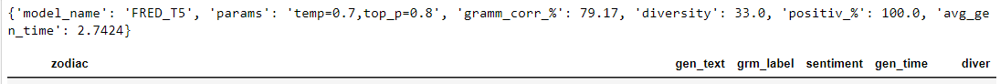
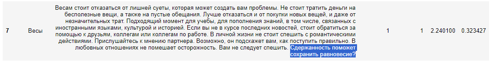

# Horoscopes_generation_model

## **Цель проекта**:

Основной целью проекта является finetune языковой (или нескольких) языковых моделей для генерации ежедневных гороскопов по знакам зодиака и добавление этой модели в чат-бот в телеграмме.

## **Этапы проекта**:
### 1. Сбор данных для обучения. 
На этом этапе необходимо собрать данные для обучения модели. Обучать модель я планирую на основе ежедневных гороскопов с привязкой к знаку Зодиака. Собранные данные находятся в папке data и включают следующие поля:

<li> data - дата сбора информации
<li> zodiac - знак Зодиака
<li> horo - гороскоп на конкретный день
<li> source - источник гороскопов.

В качестве источников гороскопов были использованы следующие сайты:

**Парсеры для сбора информации:**
- Для раскопок в архивах пришлось сделать отдельный парсер на каждый архив. Собрала их все в один ноутбук [здесь](https://github.com/shakhovak/Horoscopes_generation_model/blob/master/parsers/Archive_parser_horoscopes_fin.ipynb).
- Для ежедневных сборов подготовила [DAG](https://github.com/shakhovak/Horoscopes_generation_model/blob/master/parsers/dag_horo.py) в Airflow, который каждый день обходит порядка 10 сайтов и собирает с них ежедневные обновления в общий файл (примерно 150 в день). DAG работал до конца августа.

**Итого для проекта собрано 255 тыс. гороскопов.** Файл с необработанными данными [здесь](https://github.com/shakhovak/Horoscopes_generation_model/tree/master/data)

### 2. Отбор и обработка данных. 

Полученные данные уже предварительно обработаны при парсинге, но при этом есть еще проблемные тексты. Почистим еще раз все тексты от лишних знаков, удалим дубликаты по тексту гороскопа (да, издатели "списывают" друг у друга!!!) Весь процесс очистки и отбора в этом [ноутбуке](https://github.com/shakhovak/Horoscopes_generation_model/blob/master/EDA.ipynb).

Отберем для обучения только тексты более 300 знаков, но менее 500. Итого останется примерно 89 тыс. текстов для обучения моделей.
Гистограмма распределения текстов по длине, при этом каждый знак Зодиака представлен в отобранных текстах более или менее равномерно.

*PS:* При обработке был допущен ряд неточностей (например, удалено тире из знаков препинания, "не дочищен" рекламный текст из гороскопов и т.д.), что привело к ошибкам и в генерации текста. Часть я попробовала исправить при генерации, но удалось не все. Нужно внимательнее относится к обработке текста :sweat_smile:.

## 3. Обучение моделей. 

Для генерации гороскопов по знаку Зодиака буду файнтьюнить следующие модели:

1. https://huggingface.co/ai-forever/ruT5-base - модель T5 для русского языка, возьму ее базовую версию в качестве baseline. Ноутбук с кодом здесь.
2. https://huggingface.co/ai-forever/FRED-T5-large - Full-scale Russian Enhanced Denoisers T5. Ноутбук с кодом здесь.
3. https://huggingface.co/google/mt5-large - a multilingual variant of T5 that was pre-trained on a new Common Crawl-based dataset covering 101 languages. Ноутбук с кодом здесь.

Среда обучения - ВМ в Yandex.Cloud. Обучение на 1 GPU NVIDIA Ampere, RAM 119, 28 vCPUs [более детально](https://cloud.yandex.com/en/docs/datasphere/concepts/configurations).

Base-модели обучаются примерно 30 мин, large - 1 час.

В качестве эксперимента параметры обучения у всех моделей были одинаковые:

    learning_rate = 2e-4,
    per_device_train_batch_size = 16,
    per_device_eval_batch_size = 16,
    weight_decay = 0.01,
    num_train_epochs = 3,

Результаты обучения:

ruT5-base    

FRED-T5-large   

mt5-large   

## 4. Стратегии генерации. 
Для генерации воспользуемся стратегией семплирования, так как на мой взгляд, она может обеспечить наибольшую случайность и разнообразие, что и нужно для генерации гороскопов.

В качестве неизменных параметров генерации возьмем следующие:

            do_sample=True,
            max_length=400,
            top_k = 0,
            no_repeat_ngram_size=2, 
            early_stopping = True

 в качестве сравниваемых параметров top_p + temperature. Есть интересная статья [ссылка](https://community.openai.com/t/cheat-sheet-mastering-temperature-and-top-p-in-chatgpt-api-a-few-tips-and-tricks-on-controlling-the-creativity-deterministic-output-of-prompt-responses/172683) для трактовки поведения языковых моделей при определенных сочетаниях этих параметров.

**Temperature**  ответственна за "креативность" модели -> более высокие значения предполагают более разнообразный текст. **Top_p sampling**  дополняет параметр temperature.

Автор статьи предлагает трактовать следующим образом влияние этих параметров на генерацию текста.

В моем случае, для всех моделей я воспользуюсь вариантами: 
+ **creative writing:** top_p = 0.8, temperature = 0.7
+ **exploratory code writing:** top_p = 0.7, temperature = 0.6
+ **chat_bot:** top_p = 0.5, temperature = 0.5
+ **code comment generation:**  top_p = 0.2, temperature = 0.3

## 5. Сравнение текстов. 

Разные модели и стратегии генерации будем сравнивать и оценивать по 4-м характеристикам:

1. **Языковая приемлемость (language acceptibilty)** - корректность сформированных моделью предложений с точки зрения орфографии, синтаксиса и т.д. Воспользуемся пред обученной моделью https://huggingface.co/RussianNLP/ruRoBERTa-large-rucola, которая выдает лейбл = 1 для приемлемых с точки зрения языковых норм предложений. Будем считать % таких предложений в общем корпусе сгенерированных тестовых кейсов.

2. **Разнообразие текстов (text diversity)** - воспользуемся косинусной близостью, чтобы посмотреть похожесть текстов и возьмем разницу 1 - между средним коэффициентом для текста, что и будет характеристикой разнообразия. Для этих целей еще раз векторизуем тексты с помощью модели https://huggingface.co/sentence-transformers/LaBSE. Будем считать среднее разнообразие для выбранной модели и стратегии.

3. **Эмоциональная окрашенность текстов (text sentiment)** - положительны или отрицательны тексты по своему содержанию. Для этого также воспользуемся готовой моделью, обученной для русского языка https://huggingface.co/seara/rubert-base-cased-russian-sentiment, которая выдает 3 лейбла - neutral: нейтральный, positive: позитивный, negative: негативный. При оценке будем присваивать 0 только отрицательному лейблу, позитивный и нейтральный получат 1. Далее будем считать % НЕотрицательных текстов в сгенерированном корпусе.

4. **Среднее время на генерацию гороскопа (average time)** - будем считать время в секундах.
5. Дополнительно будем выводить несколько текстов, чтобы оценить визуально общий результат.

Чем меньше времени модель тратит на генерацию, тем лучше. Для остальных метрик чем ближе значение к 100%, тем лучше.
Оценку будем проводить на 4-х сабсетах для каждого знака Зодиака. Детально методика сравнения представлена в ноутбуке [здесь](https://github.com/shakhovak/Horoscopes_generation_model/blob/master/Text_generation%26evaluation.ipynb).

Сравнение результатов работы моделей:

Соберем все в таблице:

Примеры текстов, получивших приз зрительских симпатий:

## 6. Добавление модели в чат-бот в Телеграмме.
На последнем этапе добавлю модель FRED-T5 в чат бот в телеграмме (файл с скриптом [здесь](https://github.com/shakhovak/Horoscopes_generation_model/blob/master/horo_aiogram_bot.py). Не удалось пока разместить чат-бот в облаке, поэтому запускается только локально. Ниже принт-скрины работы чата.

