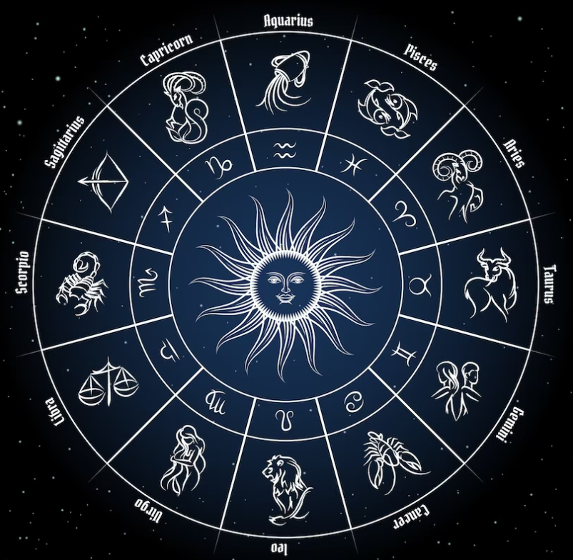

# Horoscopes_generation_model

**Цель проекта**:

Основной целью проекта является finetune языковой (или нескольких) языковых моделей для генерации ежедневных гороскопов по знакам зодиака и добавление этой модели в чат-бот в телеграмме.

**Этапы проекта**:
1. Собрать данные для обучения модели. Обучать модель я планирую на основе ежедневных гороскопов с привязкой к знаку Зодиака. Собранные данные находятся в папке дата и включают следующие поля:

<li> **data** - дата сбора информации
<li> **zodiac** - знак Зодиака
<li> horo - гороскоп на конктретный день; я решила не удалять из текста даты и дни недели, интересно посмотреть как будет их апроксимировать модели - может получиться интересный эффект.
<li> source - источник гороскопов.

В качестве источников гороскопов были использованы следующие сайты:

<li> https://sibmama.ru/- на этом сайте нашлось больше 21 тыс гороскоп за каждый день года за пероид с 2016 по 2022 гг. Золотая жила!!!! И всего 160 дубликатов!
<li> https://sakhalife.ru/category/goroskop - на этом сайте обнаружился также неплохой архив, удалось собрать 7,5 тыс гороскопов.
<li> http://vuslon.ru/news/rubric/list/goroskop-na-kazhdyy-den - еще одна удача и 3,5 тыс гороскопов за последний год.
<li> https://www.newsler.ru/horoscope - пока собираю ежедневные обновления, планирую до конца августа
<li> https://74.ru/horoscope/daily/ пока собираю ежедневные обновления, планирую до конца августа
<li> https://retrofm.ru/goroskop  пока собираю ежедневные обновления, планирую до конца августа
<li> https://horoscopes.rambler.ru  пока собираю ежедневные обновления, планирую до конца августа
<li> https://astroscope.ru/horoskop/ejednevniy_goroskop/ пока собираю ежедневные обновления, планирую до конца августа

Парсеры для сбора информации:
<li> Для раскопок в архивах пришлось сделать отдельный парсер на каждый архив. Собрала их все в один ноутбук [вот здесь](parsers\Archive_parser_horoscopes.ipynb)
<li> Для ежедневных сборов подготовила DAG в Airflow, который каждый день обходит порядка 10 сайтов и собирает с них ежедневные обновления в общий файл (примерно 150 в день). DAG будет работать до конца августа и должен собрать примерно 3 тыс.гороскопов.

Итого на 12.08.2023 собрано 33 тыс. гороскопов.