# Horoscopes_generation_model

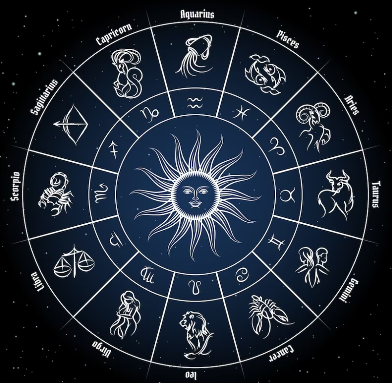

## **Цель проекта**:

Основной целью проекта является finetune языковой (или нескольких) языковых моделей для генерации ежедневных гороскопов по знакам зодиака и добавление этой модели в чат-бот в телеграмме.

## **Этапы проекта**:
### 1. Сбор данных для обучения. 
На этом этапе необходимо собрать данные для обучения модели. Обучать модель я планирую на основе ежедневных гороскопов с привязкой к знаку Зодиака. Собранные данные находятся в папке data и включают следующие поля:

<li> data - дата сбора информации
<li> zodiac - знак Зодиака
<li> horo - гороскоп на конктретный день; я решила не удалять из текста даты и дни недели, интересно посмотреть как будет их апроксимировать модели - может получиться интересный эффект.
<li> source - источник гороскопов.

В качестве источников гороскопов были использованы следующие сайты:

<li> https://sibmama.ru/- на этом сайте нашлось больше 21 тыс гороскоп за каждый день года за пероид с 2016 по 2022 гг. Золотая жила!!!! И всего 160 дубликатов!
<li> https://sakhalife.ru/category/goroskop - на этом сайте обнаружился также неплохой архив, удалось собрать 7,5 тыс гороскопов.
<li> http://vuslon.ru/news/rubric/list/goroskop-na-kazhdyy-den - еще одна удача и 3,5 тыс гороскопов за последний год.
<li> https://www.newsler.ru/horoscope - пока собираю ежедневные обновления, планирую до конца августа
<li> https://74.ru/horoscope/daily/ пока собираю ежедневные обновления, планирую до конца августа
<li> https://retrofm.ru/goroskop  пока собираю ежедневные обновления, планирую до конца августа
<li> https://horoscopes.rambler.ru  пока собираю ежедневные обновления, планирую до конца августа
<li> https://astroscope.ru/horoskop/ejednevniy_goroskop/ пока собираю ежедневные обновления, планирую до конца августа
<li> https://mygazeta.com  - еще одна золотая жила! Удалось собрать 147 тыс. гороскопов!!!
<li> https://github.com/dkagramanyan/astro - уже готовые данные для языковой модели 75 тыс.!!</li>

Финальная разбивка по сайтам-источникам информации:

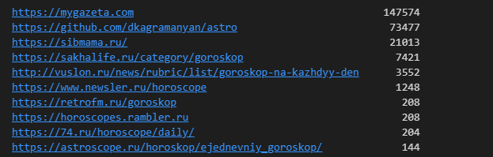

**Парсеры для сбора информации:**
<li> Для раскопок в архивах пришлось сделать отдельный парсер на каждый архив. Собрала их все в один ноутбук https://github.com/shakhovak/Horoscopes_generation_model/blob/master/parsers/Archive_parser_horoscopes.ipynb
<li> Для ежедневных сборов подготовила DAG (https://github.com/shakhovak/Horoscopes_generation_model/blob/master/parsers/dag_horo.py) в Airflow, который каждый день обходит порядка 10 сайтов и собирает с них ежедневные обновления в общий файл (примерно 150 в день). DAG будет работать до конца августа и должен собрать примерно 3 тыс.гороскопов.

**Итого для проекта собрано 255 тыс. гороскопов.** Файл с необработанными данными здесь ()

### 2. Отбор и обработка данных. 

Полученные данные уже предварительно обработаны при парсинге, но при этом есть еще проблемные тексты. Почистим еще раз все тексты от лишних знаков, удалим дубликаты по тексту гороскаопа (да, издатели "списывают" друг у друга!!!) Весь процесс очистки и отбора в этои ноутбуке.

Отберем для обучения только тексты более 300 знаков, но менее 500. Итого останется примерно 89 тыс текстов для обучения моделей.
Гистрограмма распределения текстов по длине, при этом каждый знак Зодиака представлен в отобранных текстах более или менее равномерно.

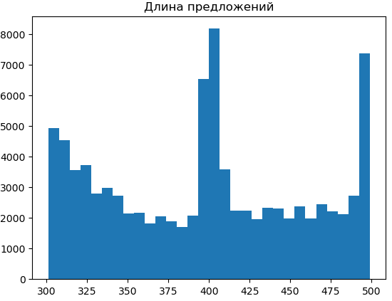

## 3. Обучекние моделей. 

Для генерации гороскопов по знаку Зодиака буду файнтьюнить следующие модели:

1. https://huggingface.co/ai-forever/ruT5-base - модель T5 для русского языка, возьму ее базовую версию в качестве baseline. Ноутбук с кодом здесь.
2. https://huggingface.co/ai-forever/FRED-T5-large - Full-scale Russian Enhanced Denoisers T5. Ноутбук с кодом здесь.
3. https://huggingface.co/google/mt5-large - a multilingual variant of T5 that was pre-trained on a new Common Crawl-based dataset covering 101 languages. Ноутбук с кодом здесь.

Среда обучения - ВМ в Yandex.Cloud. Обучение на 1 GPU NVIDIA Ampere, RAM 119, 28 vCPUs (,более детально https://cloud.yandex.com/en/docs/datasphere/concepts/configurations)

Base-модели обучаются примерно 30 мин, large - 1 час.

В качестве эксперимента параметры обучения у всех моделей были одинаковые:

    learning_rate = 2e-4,
    per_device_train_batch_size = 16,
    per_device_eval_batch_size = 16,
    weight_decay = 0.01,
    num_train_epochs = 3,

Результаты обучения:

ruT5-base    
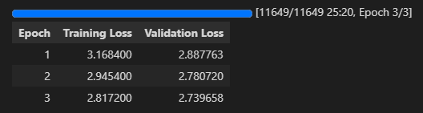

FRED-T5-large   
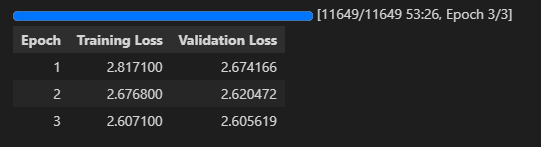

mt5-large   
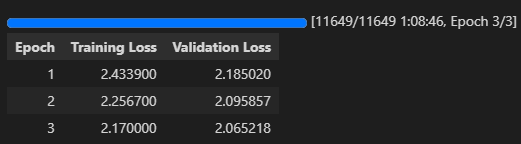

## 4. Стратегии генерации. 
Для генерации воспользуемся стратегией семплирования, так как на мой взгляд, она может обеспечить наибольшую случайность и разнообразие, что и нужно для генерации гороскопов.

В качестве неизменных параметров генерации возьмем следующие:

            do_sample=True,
            max_length=400,
            top_k = 0,
            no_repeat_ngram_size=2, 
            early_stopping = True

 в качестве сравниваемых параметров top_p + temperature. Есть интересная статья (ссылка ниже) для трактовки поведения языковых моделей при определенных сочетаниях этих параметров.

from https://community.openai.com/t/cheat-sheet-mastering-temperature-and-top-p-in-chatgpt-api-a-few-tips-and-tricks-on-controlling-the-creativity-deterministic-output-of-prompt-responses/172683

**Temperature**  ответственна за "креативность" модели -> более высокие значения предполагают более разнообразный текст.

**Top_p sampling**  дополняет параметр temperature.

Автор статьи предлагает трактовать следующим образом влияние этих параметров на генерацию текста.
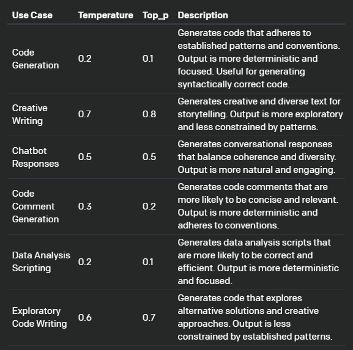

В моейм случае, для всех моделей я воспользуюсь вариантами: 
<li> creative writing: top_p = 0.8, temperature = 0.7
<li> exploratory code writing: top_p = 0.7, temperature = 0.6
<li> chat_bot: top_p = 0.5, temperature = 0.5
<li> code comment generation  top_p = 0.2, temperature = 0.3

## 5. Сравнение текстов. 

Разные модели и стратегии генерации будем сравнивать и оценивать по 4-м характеристикам:

1. **Языковая приемлимость (language acceptibilty)** - корректность сформирвоанных моделью предложений с точки зрения орфографии, синтаксиса и т.д. Воспользуемся предобученной моделью https://huggingface.co/RussianNLP/ruRoBERTa-large-rucola, которая выдает лейбл = 1 для приемлимых с точки зрения языковых норм предложений. Будем считать % таких предложений в общем корпусе сгенерированных тестовых кейсов.

2. **Разнообразие текстов (text diversity)** - воспользуемся косинусной близостью, чтобы посмотреть похожесть текстов и возьмем разницу 1 - между средним коэффициентом для текста, что и будет характеристикой разнообразия. Для этих целей еще раз векторизуем тексты с помощью модели https://huggingface.co/sentence-transformers/LaBSE. Бдуем считать среднее разнообразие для выбранной моедли и стратегии.

3. **Эмоциональная окрашенность текстов (text sentiment)** - положительны или отрицательны тексты по своему содержанию. Для этого также воспользуемся готовой моделью, обученной для русского языка https://huggingface.co/seara/rubert-base-cased-russian-sentiment, которая выдает 3 лебла - neutral: нейтральный, positive: позитивный, negative: негативный. При оценке будем присваивать 0 только отрицательному лейблу, позитивный и нейтральный получат 1. Далее будем считать % НЕотрицательных текстов в сгенерированном корпусе.

4. **Среднее время на генерацию гороскопа (average time)** - будем считать время в секундах. 

Чем меньше времени модель тратит на генерацию, тем лучше. Для остальных метрик чем ближе значение к 100%, тем лучше.

Дополнительно будем выводить несколько текстов, чтобы оценить визуально общий результат.

Оценку будем проводить на 4-х сабсетах для каждого знака Зодиака.

Сравнение результатов работы моделей:
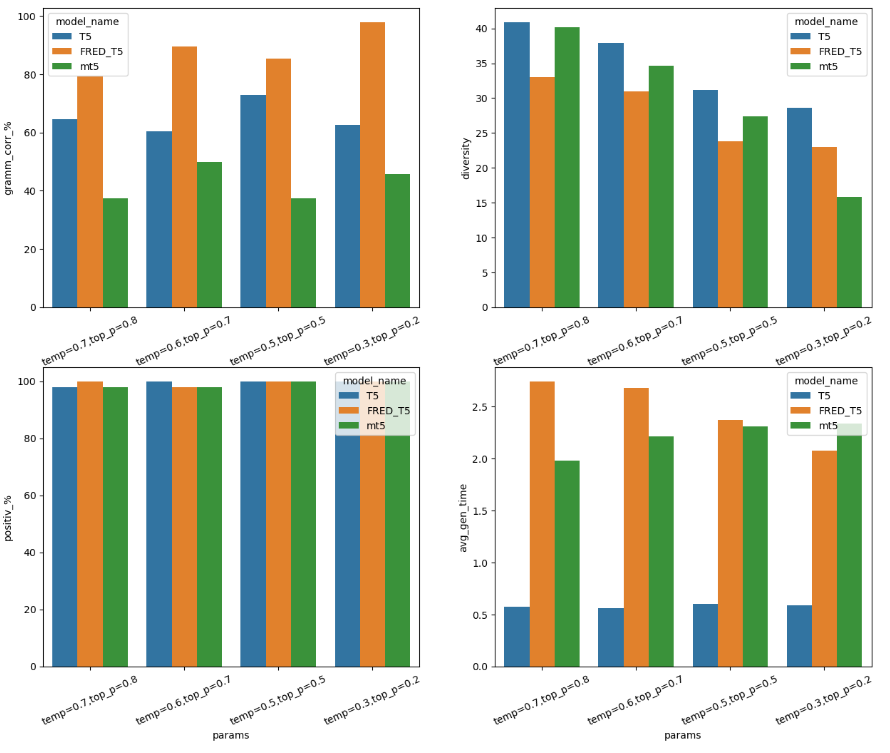

Детально методика сравнения представлена в ноутбуке здесь.

Итак, лучшие результаты по грамотности речи показала модель FRED-T5, при этом они не сильно отличаются при изменении параметров генерации.

По разнообразию текста - лучше оказалась базовая ruT5, FRED-T5 пишет больше текста, но более однотипного. При этом понижение temperature + top_p ведет в уменьшению разнообразия, как и писал автор в рассмтриваемой выще статье.

С точки зрения позитивности, все модели похожие - может дело в оценивающей модели о_О...

По времени генерации, как ожидалось, быстрее оказалось базовая модель.

Лучшей стратегий генерации, как компромисс между корректностью и разнообразием, является стратегия =  exploratory code writing: top_p = 0.7, temperature = 0.6.

Примеры текстов, получивших приз зрительских симпатий:
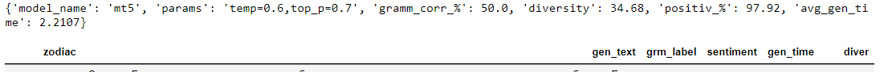
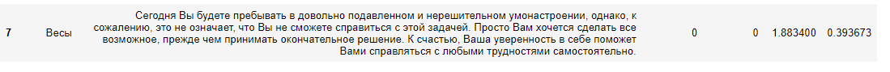

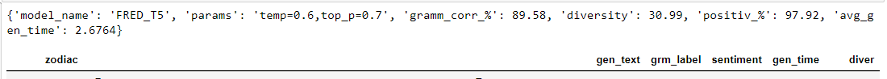
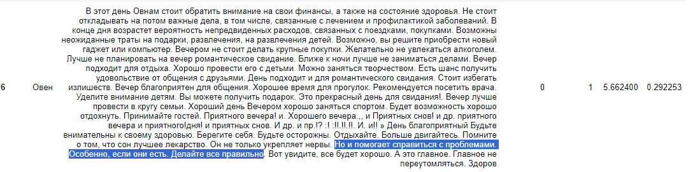

